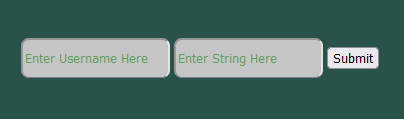
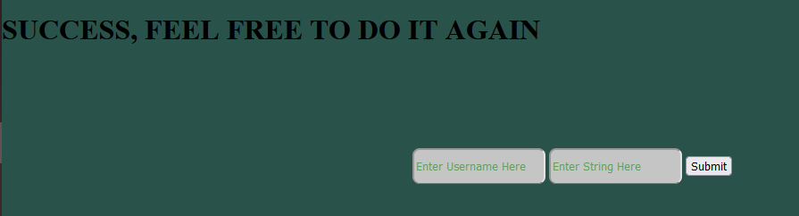
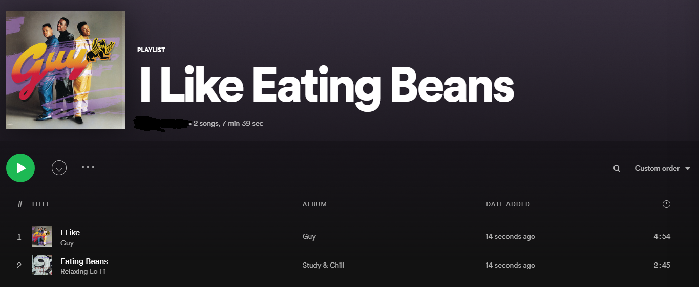

# String-To-Playlist
Python script to convert a string to a Spotify playlist if a valid combination of songs exists

## Dependencies 
Spotipy, itertools, Flask (if frontend usage is desired)

## How Backend Works
* Logs Into Spotify
* Assembles a list of possible song names
* Forms combinations of valid song names
* Checks if any combination is equivalent to string being passed in
* If it is, it creates the playlist with string name and adds all the songs
* If it is not, it fails and prompts user to retry with a different string

## Screenshots

## Planned features: 
* Remove case-sensitivity
